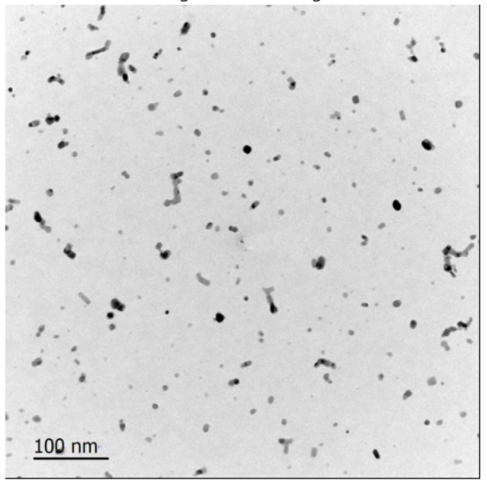

# NanoPSD
**Software Package for Analyzing Plasma-Synthesized Nanoparticle Size Distribution**

NanoPSD is a production-ready Python package designed to extract **particle size distributions (PSD)** of **Nanoparticles (NPs)** from **SEM/TEM images**.
It supports both **single-image** and **batch image** analysis, providing a modular and object-oriented pipeline for nanoparticle research and metrology.

---

## Features
- Automated **scale bar & text exclusion** from analysis
- **Particle segmentation** using classical methods (Otsu thresholding, preprocessing filters)
- **Size extraction & visualization** (histograms, plots, CSV export)
- Works with both **single images** and **batch folders**
- Modular, **object-oriented codebase** for easy extension
- Ready for future **AI/ML-based segmentation integration**

---

## NanoPSD Pipeline
The processing workflow follows these main steps:

1. **Input Acquisition** – SEM/TEM image(s) provided as single or batch mode.
2. **Preprocessing** – Contrast enhancement (CLAHE, filters) to improve particle visibility.
3. **Segmentation** – Classical thresholding (Otsu) to identify particle regions.
4. **Scale Bar & Text Exclusion** – Automatic masking of scale bar and annotation text.
5. **Particle Measurement** – Extract particle sizes and compute statistics.
6. **Visualization & Export** – Histograms, CSV tables, and segmented overlay images.

---

## Dependencies
NanoPSD requires the following Python libraries:
- `opencv-python`
- `numpy`
- `matplotlib`
- `scikit-image`
- `scipy`
- `pandas`
- `Pillow`

You can install them either via **requirements.txt** or using Conda (see Setup).

---

## Project Structure
```bash
NanoPSD/
├── main.py                 # Entry point (select single/batch mode)
├── pipeline/
│   └── analyzer.py         # Core analysis pipeline
├── scripts/
│   ├── preprocessing/      # Preprocessing filters (CLAHE, etc.)
│   └── segmentation/       # Segmentation algorithms (Otsu, etc.)
├── batch_images/           # Example batch image folder
├── SEM_Sample_Image.png    # Example input image
├── requirements.txt        # Python package dependencies
├── imglab_environment.yml  # Conda environment file
├── .gitignore
└── README.md
```
```bash
NanoPSD/
├── README.md                  # Project overview & usage
├── requirements.txt           # Python dependencies
├── imglab_environment.yml     # Conda environment
├── main.py                    # Entry point (calls CLI & pipeline)
├── sample_image_1.png
├── sample_image_2.png
├── sample_image_3.png
├── sample_image_4.tif
│
├── pipeline/                  # Orchestrates the full workflow
│   ├── __init__.py
│   └── analyzer.py            # NanoparticleAnalyzer class
│
├── scripts/                   # Modular processing steps
│   ├── __init__.py
│   ├── cli.py                 # Command-line argument parser
│   │
│   ├── preprocessing/
│   │   ├── __init__.py
│   │   └── clahe_filter.py    # Contrast enhancement (CLAHE)
│   │
│   ├── segmentation/
│   │   ├── __init__.py
│   │   ├── base.py            # Segmentation base interface
│   │   ├── otsu_impl.py       # Otsu thresholding implementation
│   │   └── otsu_segment.py    # Segmentation workflow
│   │
│   ├── analysis/
│   │   └── size_measurement.py # Particle measurement & LaTeX export
│   │
│   └── visualization/
│       └── plotting.py        # Histogram and plot outputs
│
├── utils/                     # Helper utilities
│   ├── __init__.py
│   ├── ocr.py                 # OCR for scale bar text (EasyOCR/Tesseract)
│   ├── scale_bar.py           # Scale bar detection (hybrid)
│   └── scale_barrr.py         # (Alt/experimental scale bar code)
│
├── notebooks/
│   └── PSD_Interactive_Analysis.ipynb # Jupyter notebook demo
│
└── outputs/                   # Generated results & reports
    ├── debug/                 # Debug intermediate images
    ├── figures/               # Plots, overlays
    ├── preprocessed/          # Preprocessed images
    ├── results/               # .tex & CSV summaries
    │   ├── nanoparticle_data.csv
    │   └── sample_image_*_summary.tex
    └── report.tex             # Example LaTeX report
```

---

## Installation & Setup

### 1. Clone the repository
```bash
git clone https://github.com/Huq2090/NanoPSD.git
cd NanoPSD
```

### 2. Create and activate Conda environment
```bash
conda create -n imglab python=3.10
conda activate imglab
```

### 3. Install dependencies
```bash
conda install -c conda-forge opencv numpy matplotlib scikit-image scipy pandas pillow
```

Or recreate directly from the environment file:
```bash
conda env create -f imglab_environment.yml
conda activate imglab
```

---

## Usage

### Single Image Analysis
1. Place your SEM/TEM image in the project folder (or provide a path).
2. Run the following command if you provide the Scale bar reading (say 200 nm):
```bash
python main.py --mode single --input sample_image_1.png --algo classical --min-size 3 --scale 200 --ocr auto/easyocr/tesseract
```
3. Run the following command if you do not provide the Scale bar reading:
```bash
python main.py --mode single --input sample_image_1.png --algo classical --min-size 3 --scale -1 --ocr auto/easyocr/tesseract
```

### Batch Image Analysis
1. Place multiple SEM/TEM images in a folder (e.g., `batch_images/`).
2. Run:
```bash
python3 main.py --mode batch --input ./batch_images --scale 200
```

### Auto/CPU/GPU Processing of OCR
1. auto - will automatically select CPU or GPU based on availability
2. easyocr - will use GPU
3. tesseract - will use CPU

---

## Outputs
- **Particle size histogram** (`histogram.png`)
- **Tabulated results** (`results.csv` with particle diameters/statistics)
- **Visualization plots** (segmented overlays)

Example CSV output:
```csv
Particle_ID, Diameter_nm
1, 42.5
2, 37.8
3, 56.2
...
```

---

## Example Results
*(Insert sample figures here in your repo for best presentation)*

- **Raw SEM Image**
  

- **Segmented Overlay**
  *(example segmented image output)*

- **Particle Size Histogram**
  *(example histogram plot)*

---

## Roadmap
- [ ] Integrate **AI-assisted segmentation**
- [ ] Extend support for **TEM images with diffraction patterns**
- [ ] Advanced morphology analysis (aspect ratio, circularity, shape factor)
- [ ] Jupyter Notebook integration for reproducible workflows

---

## Contributing
Contributions are welcome! Please fork the repo and submit a pull request.

Guidelines:
- Document new features clearly.
- Provide test images/examples.
- Ensure PEP8 compliance.

---

## License
This project is licensed under the **MIT License** – see the [LICENSE](LICENSE) file for details.
- I will update the License after talking with Prof. Davide

---

## Citation
If you use NanoPSD in academic work, please cite:

*Huq, MF. (2025). NanoPSD: Automated Nanoparticle Size Distribution Analysis from Electron Microscopy Images.*

---


